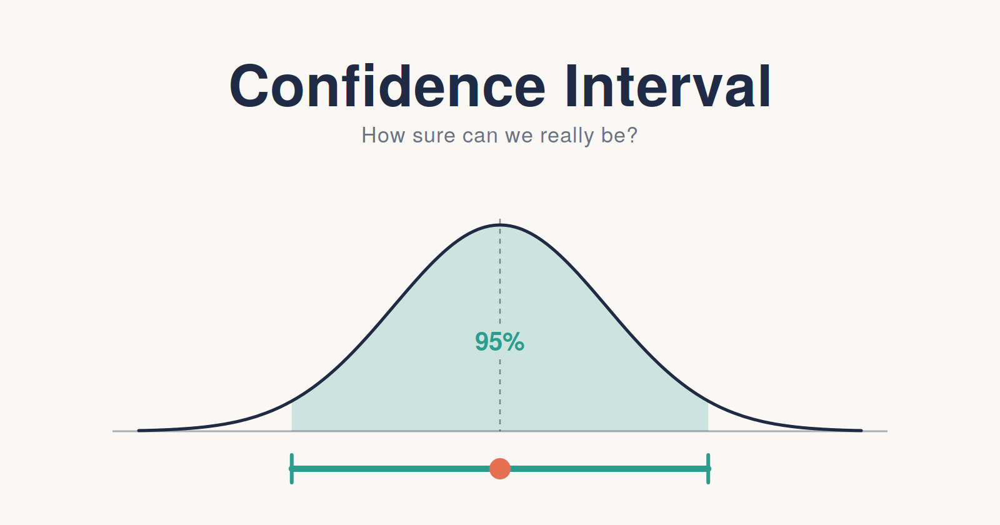
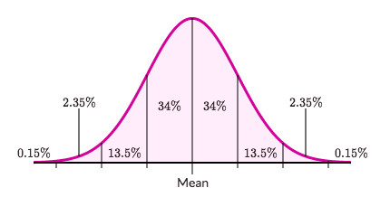
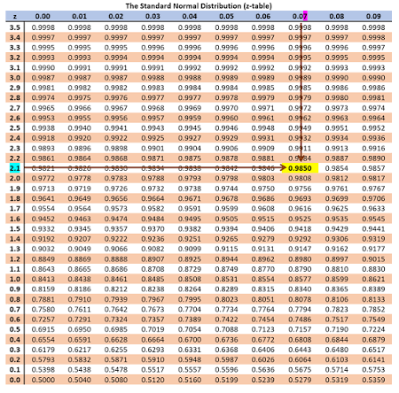
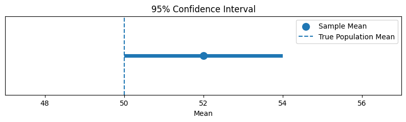
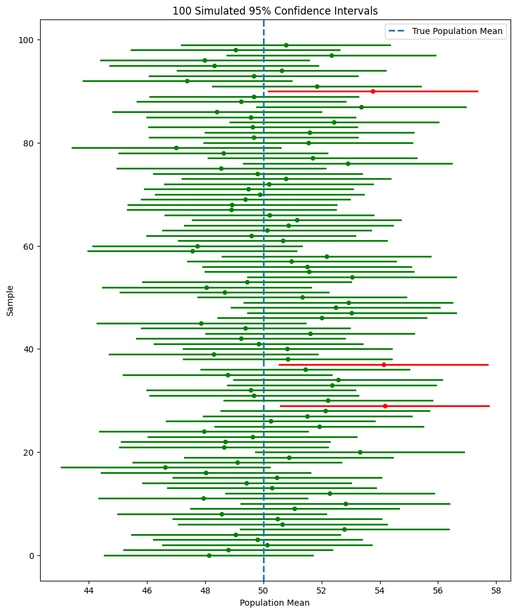

# Confidence Intervals: The Art of Being Honestly Uncertain #

## Margin of error, critical values, and a common misunderstanding ##

We ended our previous blog on a very unconventional discussion, which made no sense right?

To leave you with that till this blog was a gig. In this blog we will be talking about something very important in our "Statistical Journey".

**Confidence Interval**

I bet that this name is not unknown to you. I was also once very unclear about this topic till I took the challenge to learn it to the depth in the form of a story, why and how?

We discussed earlier right? why there was a need of "sampling data" and how it told us about our "population data". 

We took a sample and calculated its mean but the question here was how close it was to the true population mean. This somehow created a need of interval.

In the example, our very first sample mean came: $$\bar{X} = ₹213,333$$ 

which is a **Point Estimate** but what if we can express in the form of **Interval Estimate** (for illustration) i.e 

$$ ₹150000 < \mu < ₹300000 $$

and these values are not random they are calculated from the repeated sample mean observations and is known as **Confidence Interval**. So a formal definition would be:

     A confidence interval gives us a range of values constructed from sample data that is designed to capture the unknown population parameter with a certain level of confidence.

If we think it is basically:

            Estimate ± Margin of Error

What is this "Margin of Error"?

The margin of error tells us how far we move away from our point estimate to create the interval.

Remember from our sampling distribution article:

When we take repeated samples, the sample means vary.

That variation is measured using the Standard Error.

For a population mean:

$$ SE_{\bar{x}}=\frac{\sigma}{\sqrt n} $$

So if we know the standard error, we have an idea of how much our sample mean can vary from sample to sample.

But we also need to decide how much of that variation we want to cover.

That's where the **critical value** comes in.
We will discuss about this later on.

Therefore:

$$ {\text{Margin of Error}= \text{Critical Value}\times\text{Standard Error}} $$

And therefore:

$$ { \text{Confidence Interval} = \text{Estimate} \pm (\text{Critical Value}\times\text{SE}) } $$

You'll commonly see:

- 90% confidence

- 95% confidence

- 99% confidence



95% or so does NOT mean that there is a 95% probability that the particular interval you calculated contains $\mu$.

Confidence level tells us how much of the sampling distribution we want our interval-building procedure to capture.

For 95% confidence interval we get critical value of 1.96, which becomes

$$ { \bar{x}\pm1.96(SE) } $$

but why 1.96? How did this value come about?

For a **standard normal distribution**:

$$ Z\sim N(0,1) $$

It is centered at 0.
The total area under the curve represents 100% of the probability.

We want a 95% confidence level.

So we want to capture 95% of the area in the middle of the distribution.

That leaves:

$$ 100\%-95\%=5\% $$

outside.

Because the normal distribution is symmetric, we split that 5% equally between the two tails.

So:

$$\frac{5}{2}\%$$

$$= 2.5\%$$

Therefore 2.5% on each side.

2.5% + 95% + 2.5% = 100%

now we ask:

"What Z-score has 97.5% of the distribution to its left?"

How 97.5%? 

95% + 2.5% = 97.5%

So the Z-score which gives 97.5% to its left gives 1.96.

The distribution is symmetric so for the right side it remains same just the change in direction giving -1.96.

Therefore:

$$P(-1.96 \lt Z \lt 1.96) = 95\%$$

Similarly,

$$P(-1.645 \lt Z \lt 1.645) \approx 90\%$$

$$P(-2.576 \lt Z \lt 2.576) \approx 99\%$$

please refer to the z-table from below:



Did you notice something above? 

$$90\% \rightarrow z \approx 1.645$$

$$95\% \rightarrow z \approx 1.96$$

$$99\% \rightarrow z \approx 2.576$$

as the confidence is increasing the value of z is also increasing, but shouldn't it be the inverse? We want to be more confident, so why are we paying for it with a larger z? 

But it doesn't work like that.

Suppose you're trying to catch a ball.

If you want to be reasonably sure you'll catch it, you can stand in a small area.

But if you want to be almost certain, you need to make the area larger.

Same idea here.

Higher $z$ means larger margin of error.

Therefore:

          Higher confidence → wider CI


Let's use it once:

Suppose:

$$ \bar{x}=100 $$

and:

$$ SE=5 $$

We want a 95% confidence interval.

For 95% confidence:

$$ z=1.96 $$

First calculate the margin of error:

$$ ME=1.96\times5 $$ $$ ME=9.8 $$

Then:

$$ CI=100\pm9.8 $$

Therefore:

$$(90.2,109.8)$$

So our confidence interval is:

$$ 90.2<\mu<109.8 $$

Do you remember in previous blog how with an example I showed you the effect of *n* on **standard error**. How increasing *n* can narrow down our curve therefore we can connect it directly here that increasing the value of *n* will give us a narrower interval.

Therefore:

$$ {\text{Larger sample} --> \text{smaller SE} --> \text{smaller margin of error} --> \text{narrower CI}} $$

Concluding this with what actually 95% confidence interval mean:

    "A 95% confidence level means that if we repeatedly took samples and constructed confidence intervals using the same method, about 95% of those intervals would contain the true population parameter."


Here we are dealing with a population mean which is unknown but somehow if we know the population standard deviation $(\sigma)$ we get:

$$ \bar{x}\pm z_{\alpha/2}\frac{\sigma}{\sqrt n} $$

the z-score we have been talking about, but what if the population standard deviation is unknown too, and that is a very realistic case, we move with **t-distribution**:

$$ \bar{x}\pm t_{\alpha/2,n-1}\frac{s}{\sqrt n} $$

We will be talking about this in the further section.

There is one more important term we should learn, that is **Prediction Interval**. 

Suppose we want to estimate the average salary of employees.

     That's a population parameter → confidence interval.

But suppose we want to predict the salary of one new employee.

      That's a different problem → prediction interval.


"Prediction intervals are generally wider because an individual observation has more variability than the estimated population mean."


Now let's connect this to **Data Science**. Why is it so important? While figuring out the data you got a point estimation and then the confidence interval that tells you how uncertain your point estimate is.

We already know how to calculate confidence interval but let us see it using scipy in python:

```
import scipy.stats as stats

sample_mean = 52
population_std = 10
sample_size = 100
confidence_level = 0.95

# Standard Error
standard_error = population_std / (sample_size ** 0.5)

# Calculate confidence interval
confidence_interval = stats.norm.interval(
    confidence_level,
    loc=sample_mean,
    scale=standard_error
)

print("95% Confidence Interval:", confidence_interval)
```
    95% Confidence Interval: (50.04, 53.96)


```
import matplotlib.pyplot as plt

sample_mean = 52
lower = 50.04
upper = 53.96
true_mean = 50

plt.figure(figsize=(10, 2))

# Confidence interval
plt.plot([lower, upper], [0, 0], linewidth=5)

# Sample mean
plt.scatter(sample_mean, 0, s=100, label="Sample Mean")

# True population mean
plt.axvline(true_mean, linestyle="--", label="True Population Mean")

plt.xlim(47, 57)
plt.yticks([])
plt.xlabel("Mean")
plt.title("95% Confidence Interval")

plt.legend()
plt.show()
```



Here the population mean is 50, but our one sample gave a mean of 52. Notice that this interval (50.04, 53.96) just misses the true mean. This is one of the roughly 5% of intervals that fail.

```
import numpy as np
import matplotlib.pyplot as plt

# Population parameters
population_mean = 50
population_std = 10

# Simulation settings
sample_size = 30
num_intervals = 100
confidence_level = 0.95

# Critical value for 95% CI
critical_value = 1.96

# Store intervals
intervals = []

np.random.seed(42)

for i in range(num_intervals):

    # Take a random sample from the population
    sample = np.random.normal(
        population_mean,
        population_std,
        sample_size
    )

    # Sample mean
    sample_mean = np.mean(sample)

    # Standard Error
    standard_error = population_std / np.sqrt(sample_size)

    # Margin of Error
    margin_of_error = critical_value * standard_error

    # Confidence interval
    lower = sample_mean - margin_of_error
    upper = sample_mean + margin_of_error

    # Does the interval contain the true population mean?
    contains_true_mean = lower <= population_mean <= upper

    intervals.append(
        (lower, upper, sample_mean, contains_true_mean)
    )
```
```
plt.figure(figsize=(10, 12))

for i, (lower, upper, sample_mean, contains_true_mean) in enumerate(intervals):

    if contains_true_mean:
        color = "green"
    else:
        color = "red"

    plt.plot(
        [lower, upper],
        [i, i],
        color=color,
        linewidth=2
    )

    plt.scatter(
        sample_mean,
        i,
        color=color,
        s=20
    )

# True population mean
plt.axvline(
    population_mean,
    linestyle="--",
    linewidth=2,
    label="True Population Mean"
)

plt.xlabel("Population Mean")
plt.ylabel("Sample")
plt.title("100 Simulated 95% Confidence Intervals")

plt.legend()
plt.show()
```


On taking 100 random samples at 95% confidence interval the green lines are the ones including the population mean and the red ones are the ones which are not. We can see clearly 97 caught the true mean while 3 couldn't which is consistent with the statement of a 95% confidence interval.

It does not mean "there's a 95% chance the true mean is inside this particular interval." The true mean is a fixed number, it's either in your interval or it isn't.

It means, if you repeated the process many times, about 95% of the intervals you build would contain the true mean.

Confidence intervals tell us where the population mean could be. Hypothesis testing helps us decide whether a specific claim about it is true or not. Let's begin with the fundamentals in the next blog. Till then **HAPPY LEARNING**.